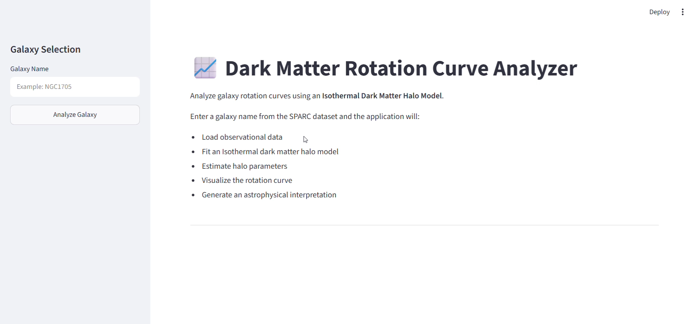
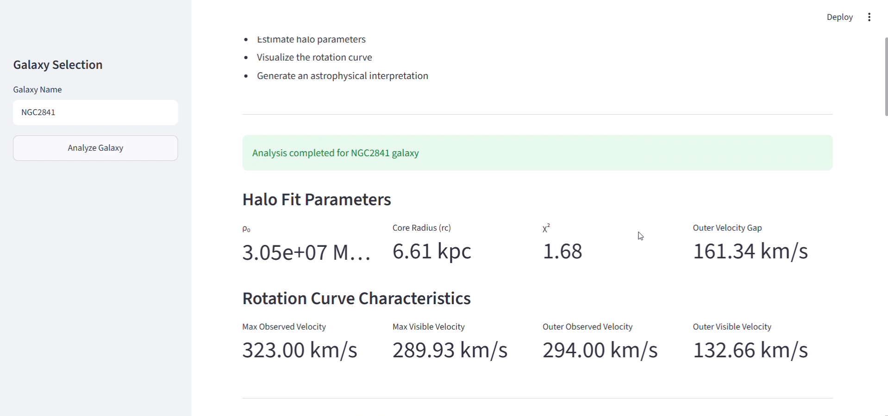
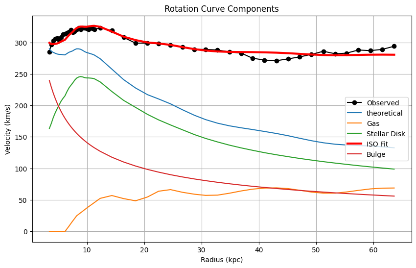
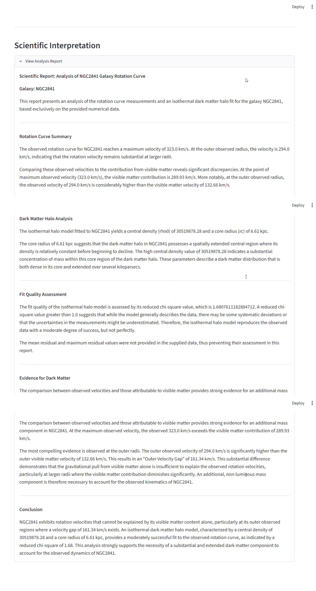

# 📈 HaloFit - Dark Matter Rotation Curve Analyzer

Dark Matter Rotation Curve Analyzer is an astrophysics-focused AI application that analyzes galaxy rotation curve observations, fits dark matter halo models, evaluates model performance, and generates scientific interpretations automatically. The project combines computational astrophysics, data analysis, machine learning workflows, and Large Language Models to investigate one of the biggest mysteries in modern astronomy: the existence of dark matter.

---

## 🚀 Features

- Analyze real galaxy rotation curve observations from the SPARC dataset
- Generate theoretical rotation curves
- Fit Dark Matter Halo Models using optimization techniques
- Compare observed and predicted galaxy dynamics
- Calculate statistical goodness-of-fit metrics
- AI-generated astrophysical interpretation reports

---

## 🏗️ System Architecture

```text
SPARC Galaxy Data
       │
       ▼
Data Preprocessing
       │
       ▼
Observed Rotation Curve
       │
       ▼
Baryonic Velocity Components (Bulge + Disk + Gas)
       │
       ▼
Dark Matter Halo Model (Isothermal Sphere)
       │
       ▼
Parameter Optimization
       │
       ▼
Best Fit Rotation Curve
       │
       ▼
Statistical Evaluation (χ², RMSE, R²)
       │
       ▼
LLM Scientific Analysis
     
```

---

## 🛠️ Tech Stack

### AI & LLM

- LangChain
- Prompt Engineering
- Gemini 2.5 Flash
- Google Generative AI Embeddings

### Data Science

- NumPy
- Pandas
- SciPy

### Frontend

- Streamlit

### Programming Language

- Python

---

## 📚 Scientific Background

Galaxy rotation curves provide one of the strongest pieces of evidence for dark matter.According to Newtonian dynamics, orbital velocities should decrease at large distances from the galactic center. However, observations show that galaxy rotation curves remain approximately flat, implying the presence of unseen mass.

This project analyzes observed galaxy dynamics and evaluates whether dark matter halo models can explain the discrepancy between visible matter and observed rotational velocities.

---

## ⚙️ How It Works

1. Galaxy rotation curve data is loaded from the SPARC dataset.
2. Observed rotational velocities are extracted.
3. Velocity contributions from bulge, disk, and gas are computed.
4. A theoretical baryonic rotation curve is generated.
5. An Isothermal Dark Matter Halo model is fitted.
6. Model parameters are optimized using non-linear curve fitting.
7. Predicted and observed velocities are compared.
8. Statistical performance metrics are calculated.
9. Gemini generates an astrophysical interpretation of the results.
10. Results are displayed through an interactive dashboard.

---

## 📂 Project Structure

```text
Dark Matter Rotation Curve Analyzer/
│
├── app.py
├── analysis.py
├── report_generator.py
├── requirements.txt
├── README.md
│
├── data/
│
├── screenshots/
│
└── .gitignore
```

---

## 🔧 Installation

### Clone the Repository

```bash
git clone https://github.com/Akshat17400560/GravityLens.git
```

### Install Dependencies

```bash
pip install -r requirements.txt
```

### Configure Environment Variables

Create a `.env` file:

```env
GOOGLE_API_KEY=your_google_api_key
```

### Run the Application

```bash
streamlit run app.py
```

---

## 💡 Example Questions

- Does this galaxy require a dark matter halo?
- How well does the Isothermal Halo model fit the observations?
- What is the estimated dark matter density?
- How significant is the discrepancy between baryonic matter and observations?
- Which regions show the largest residual errors?
- What does the fitted core radius imply about the galaxy structure?

---

## 📸 Screenshots

### Home Page



### Statistical Parameters



### Rotation Curve Graph of NGC2841 Galaxy



### Scientific Interpretation Report



---

## 🎯 Key Concepts Demonstrated

- Computational Astrophysics
- Dark Matter Halo Modeling
- Galaxy Rotation Curves
- Non-Linear Optimization
- Prompt Engineering
- Scientific Data Analysis
- Statistical Model Evaluation
- LLM-Powered Scientific Reporting

---

## 🔮 Future Improvements

- NFW Halo Profile
- Burkert Halo Profile
- Multi-Model Comparison Framework
- Bayesian Parameter Estimation
- Automated Research Paper Generation
- LangGraph-Based Scientific Agent Workflow

---

## 👨‍💻 Author

**Akshat Verma**

AI Engineer | Computer Science Graduate

Passionate about AI, Space Science, LLM Applications, and Intelligent Systems.

---

## ⭐ Acknowledgements

- LangChain
- SPARC Database
- Google Gemini
- Streamlit
  


